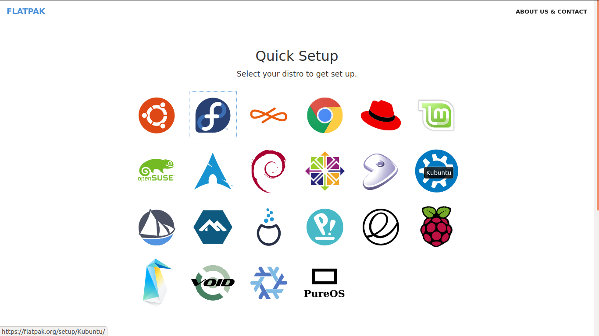
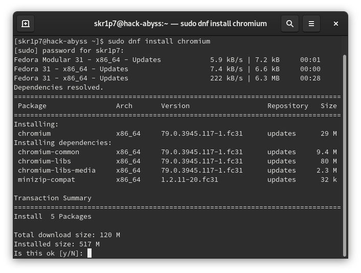
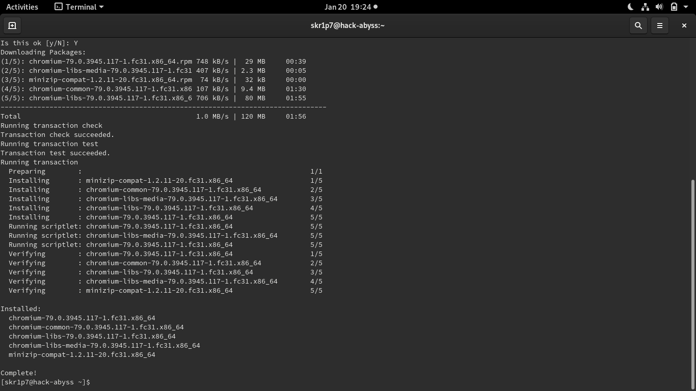
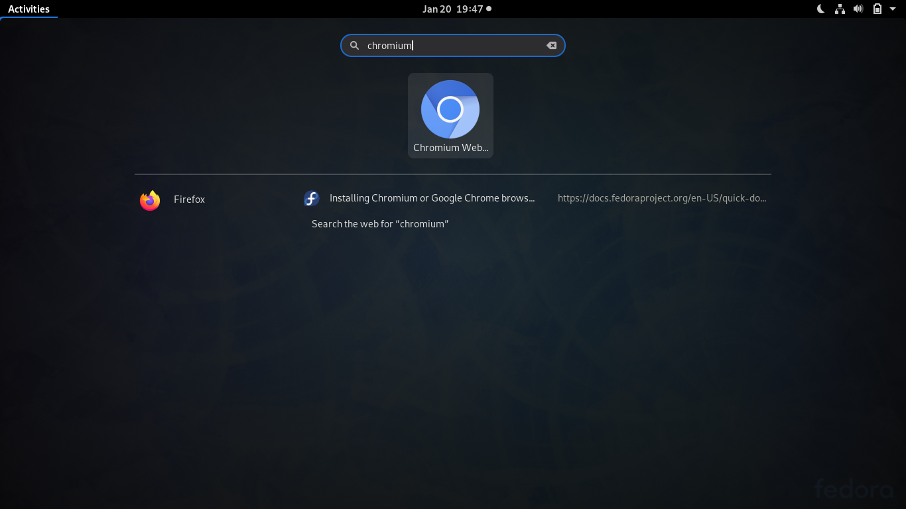

# Chromium installation of Fedora SilverBlue

As we are using Fedora 35 for this walkthrough, we have GNOME Desktop Environment as default so most of our requirements are already complete. In case you are using some other Spins like KDE, XFCE etc, get your Flatpack from [here](https://flatpak.org/setup/Fedora/) 

The Flatpack website looks like this:



If you wish to go the "c0d3r" way, fire up your terminal and write the following command to add the Flatpack repository:

```bash
$ sudo flatpak remote-add --if-not-exists flathub https://flathub.org/repo/flathub.flatpakrepo
```

After the above steps are completed successfully, it his highly recommended to update the packages, use the following command to get everything in shape:

```bash
$ dnf update
```

Let's now get off to install Chromium in your Fedora machine, in the terminal, type the following command:

```bash
$ dnf install chromium
```

The installation is around 110+ MB and should look like the screenshot attached below:



After a couple of minutes ( or a few miliseconds if you belong to NASA :P), your installation wizard, here, terminal window should look like this:



Close the terminal window and search for **Chromium**, the blue icon of Google Chromium should appear:



Click on the icon and you should see the Chrmoium window with [Fedora Project](https://start.fedoraproject.org) website open:


## That was it! 
## Find me on [Twitter](https://twitter.com/0xskr1p7)

  


 
